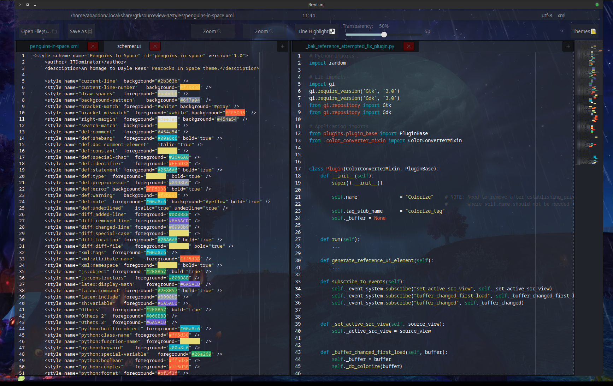
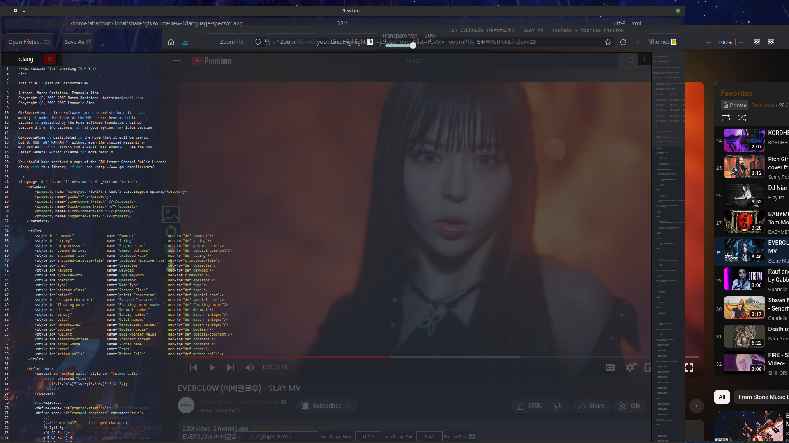
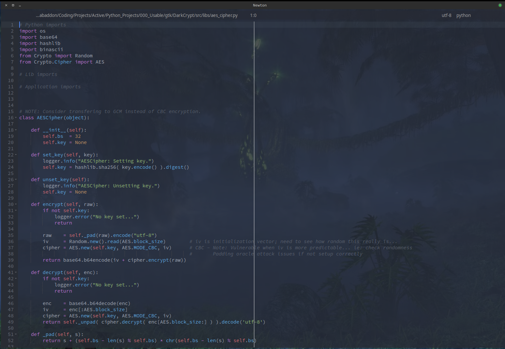
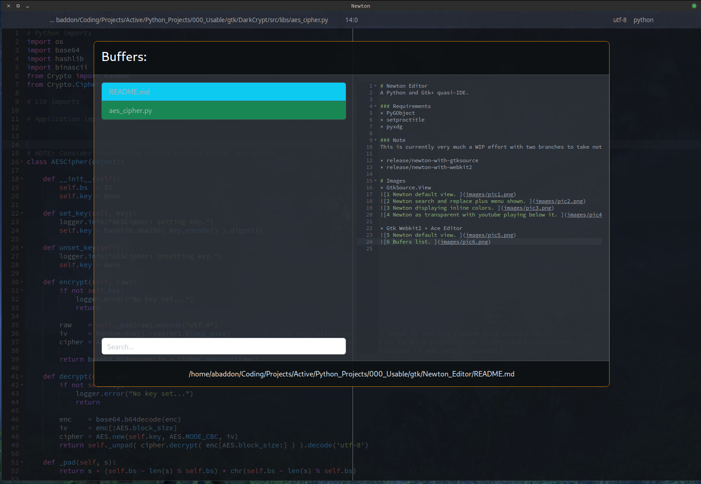

# Newton Editor
A Python and Gtk+ quasi-IDE.

### Requirements
* PyGObject
* setproctitle
* pyxdg

### Note
This is currently very much a WIP effort with two branches to take note of. The first uses GtkSource.View widget to handle text edits and display. The second uses the Gtk Webkit2 widget along with Ace Editor to handle text editing. The first is more traditional in visual design and editing. While the second is more like Vi, Vim, NeoVim.

* release/newton-with-gtksource
* release/newton-with-webkit2 

# LSP
Add lsp-ws-proxy somewhere in $PATH and make executable. Download from:

* https://github.com/qualified/lsp-ws-proxy

# Images
* GtkSource.View

* Gtk Webkit2 + Ace Editor

